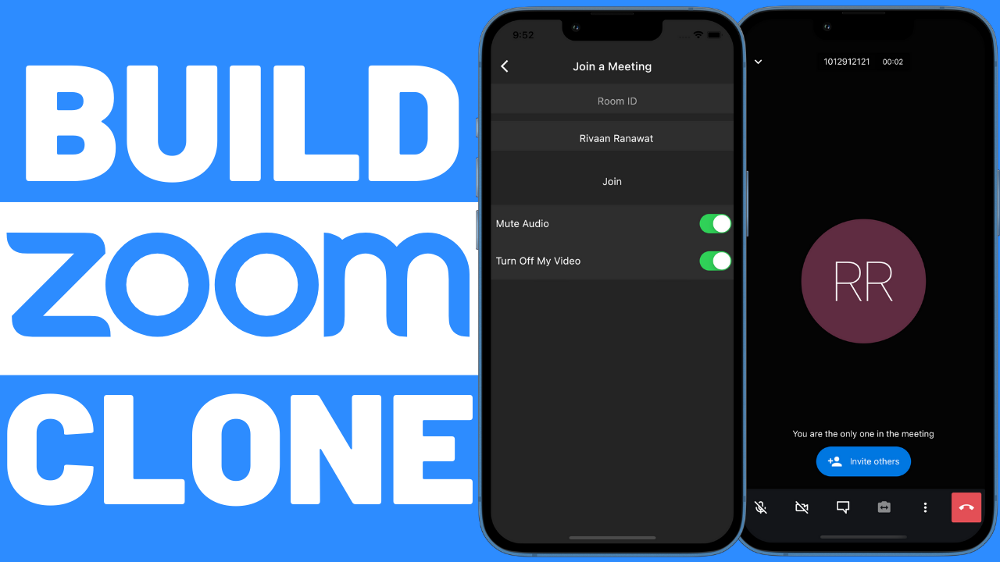

# 🔗 Flutter Zoom Clone

A Zoom-like video calling app built using **Flutter**, **Firebase**, and **Jitsi Meet SDK**. Fully functional for Android and iOS.

---

## 🚀 Features

- ✅ Google Sign-In Authentication
- 🎥 Create and Join Meetings
- 🔇 Mute/Unmute Audio
- 📵 Turn Off/On Video
- 🧑‍💼 Change Display Name
- ✋ Raise Hand
- 🖥️ Screen Sharing
- 🎬 Live Streaming
- 👥 Mute All Participants
- 💬 In-Meeting Chat
- 🔁 Switch Front/Rear Camera
- 🖼️ Picture-in-Picture Support
- 🗂️ Tile View
- 🧑‍💻 Meeting History Tracking
- 🔚 End Call
- 🔓 Logout

---

## 📦 Tech Stack

### 🔧 Backend
- **Firebase Authentication**
- **Firebase Firestore**
- **Google Sign-In**

### 💻 Frontend
- **Flutter**
- **Jitsi Meet SDK** (`jitsi_meet_flutter_sdk`)
- **State Management** using `setState` (customize as per your architecture)
- Clean and responsive UI

---

## 📸 Screenshots

<p align="center">
  
</p>

---

## 🔧 Getting Started

1. Clone the repository:
   ```bash
   git clone https://github.com/piro-piyush/zoom_clone.git
   cd zoom_clone
   ```

2. Install dependencies:
   ```bash
   flutter pub get
   ```

3. Configure Firebase:
    - Create a Firebase project
    - Add `google-services.json` for Android and `GoogleService-Info.plist` for iOS
    - Enable Google Sign-In

4. Run the app:
   ```bash
   flutter run
   ```

---

## 📲 Packages Used

- [`firebase_core`](https://pub.dev/packages/firebase_core)
- [`firebase_auth`](https://pub.dev/packages/firebase_auth)
- [`cloud_firestore`](https://pub.dev/packages/cloud_firestore)
- [`google_sign_in`](https://pub.dev/packages/google_sign_in)
- [`jitsi_meet_flutter_sdk`](https://pub.dev/packages/jitsi_meet_flutter_sdk)

---

## 📹 YouTube Tutorial

This project is inspired by [Rivaan Ranawat's YouTube Tutorial](https://youtu.be/sMA1dKbv33Y). Check it out for an in-depth walkthrough.

---

## 🧑‍💻 Author

Built with ❤️ by [Piyush](https://github.com/piro-piyush)  
If you like it, don't forget to ⭐ the repo!

---

## 📃 License

MIT License © [Piyush]
